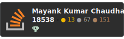

 &nbsp;&nbsp;&nbsp;&nbsp;  &nbsp;&nbsp;&nbsp;&nbsp;  &nbsp;&nbsp;&nbsp;&nbsp; 

  

<!--  -->

<!--  -->

> Dynamic and detail-oriented Software Architect with a knack for conceptualizing and delivering elegant, user-friendly solutions effectively and efficiently. Enjoy building powerful web applications, learning new technologies, and improving overall knowledge. A dedicated and persistent person. A team player but do not shy away from working as an individual contributor.

> Experience: 9 years, Architect/Senior/Lead Full Stack/Front End Engineer

**Key Skills**: JavaScript/TypeScript, React/Next.js/JSX, HTML/CSS/SCSS, Vue.js/Nuxt.js, Firebase, Prisma, Firefox-addon, Azure/Amazon Web Services/Google Cloud Platform, Android/Java

#### https://mayank-chaudhari.vercel.app

### Career Highlights

- Top 1% talent on Upwork with 100% 5-star client feedback.
- Amazing clients and collaborators including Microsoft, WHO, Sequoia Capital, Just Analytics, NUS, MIT, Default
- Multi-domain expertise with experience working on cutting-edge projects - Front end and Android, Nextgen Solar cell research (in collaboration with MIT), Advanced scrapping with cognitive capabilities, Computer vision and ML POCs, MVP – Tele-bot powered by data and AI that talked like human and understood human language, cutting-edge front-end project.
- [Microsoft certified professional](https://www.credly.com/badges/174bcfa0-e51c-4836-ac00-bf8c43f5ae0a/public_url).
- Open source contributor: GitHub   

<!-- social badges -->

# [Courses](https://mayank-chaudhari.vercel.app/courses)

- [The Game of Chess with Next.js, React and TypeScrypt](https://www.udemy.com/course/game-of-chess-with-nextjs-react-and-typescrypt/?referralCode=851A28F10B254A8523FE)
- [React + Next JS with TypeScript](https://www.udemy.com/course/react-and-next-js-with-typescript/?referralCode=7202184A1E57C3DCA8B2)
- [Vue 3 Essentials](https://www.udemy.com/course/vue-3-essentials/?referralCode=E6D2FDE2B8B06C1991F1)
- [Vue.JS Crash Course + Guide](https://www.udemy.com/course/vuejs-complete-course-plus-guide/?referralCode=93BDA4A1FE3F73C37CD2)

# [Blogs](https://mayank1513.medium.com/)

<!-- BLOG-POST-LIST:START -->
- [The Role and Importance of Unit Testing, Integration Testing, and End-to-End &lpar;E2E&rpar; Testing in React.](https://mayank1513.medium.com/the-role-and-importance-of-unit-testing-integration-testing-and-end-to-end-e2e-testing-in-react-b2f9174ccffa?source=rss-c239fa1052f9------2)
- [Understanding dvh: The CSS Dynamic Viewport Height](https://mayank1513.medium.com/understanding-dvh-the-css-dynamic-viewport-height-9ddf70a77c6c?source=rss-c239fa1052f9------2)
- [Unveiling the Good and the Grit: Barrel Files in Node.js Development](https://mayank1513.medium.com/unveiling-the-good-and-the-grit-barrel-files-in-node-js-development-845ee282fd32?source=rss-c239fa1052f9------2)
- [Enter the New Era of React 18 Library Building: Introducing esbuild-plugin-react18-css](https://mayank1513.medium.com/enter-the-new-era-of-react-18-library-building-introducing-esbuild-plugin-react18-css-becf1916c97c?source=rss-c239fa1052f9------2)
- [Maximizing Your Learning Potential: Getting the Best Out of an Online Software Engineering Course](https://mayank1513.medium.com/maximizing-your-learning-potential-getting-the-best-out-of-an-online-software-engineering-course-029f5d1ccd32?source=rss-c239fa1052f9------2)
<!-- BLOG-POST-LIST:END -->

<!--
**mayank1513/mayank1513** is a ✨ _special_ ✨ repository because its `README.md` (this file) appears on your GitHub profile.

Here are some ideas to get you started:

- 🔭 I’m currently working on ...
- 🌱 I’m currently learning ...
- 👯 I’m looking to collaborate on ...
- 🤔 I’m looking for help with ...
- 💬 Ask me about ...
- 📫 How to reach me: ...
- 😄 Pronouns: ...
- ⚡ Fun fact: ...
-->
